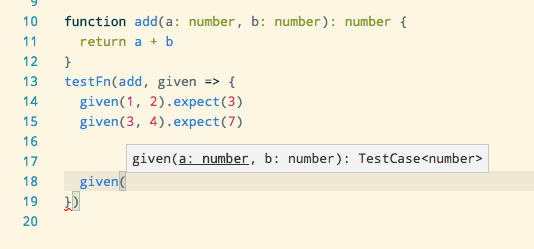

# tisane

Minimal type-safe testing

I was impressed by the brevity of [sazerac](https://github.com/mikec/sazerac), however I dearly wanted the type safety and autocomplete functionality of TypeScript and Visual Studio Code.

This is the result:



Compatible with Jasmine test runners (jasmine, jest, karma, etc.)

## Example

Before:

```typescript
function add(a: number, b: number): number {
  return a + b
}

describe('add', () => {
  it('should add 1 and 2 to equal 3', () => {
    expect(add(1, 2)).toEqual(3)
  })

  it('should add 3 and 4 to equal 7', () => {
    expect(add(3, 4)).toEqual(7)
  })
})
```

After:

```typescript
import { testFn } from 'tisane'

function add(a: number, b: number): number {
  return a + b
}
testFn(add, given => {
  given(1, 2).expect(3)
  given(3, 4).expect(7)
})
```

To see it running locally, run `npm install` and then `jest` and see the result.

## Todo

* Test output could be better, right now it's JSON stringified with two-space indents.
  * If input & output are one-liners, keep the result on the same line.
* Check that it works with mocha, ava and other popular test runners
